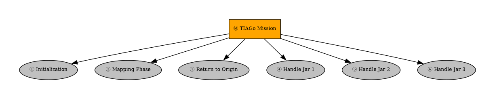
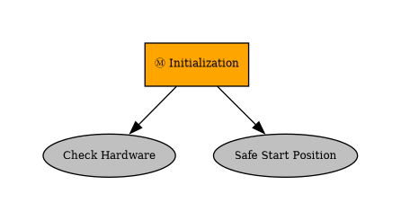
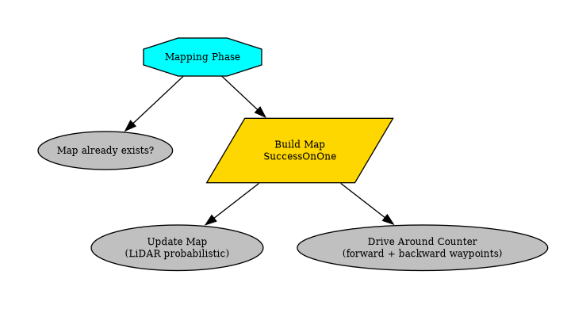
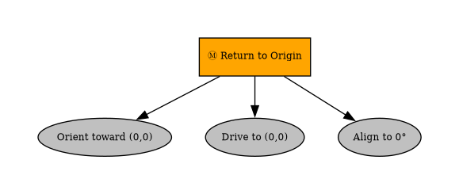
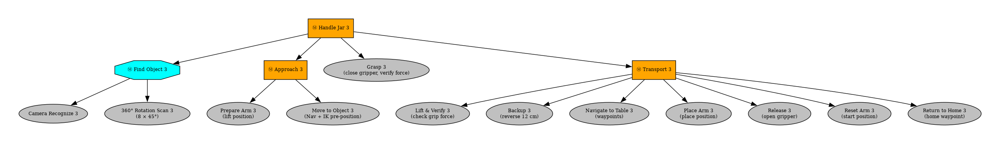

# PAL TIAGo — ikpy Mobile Manipulator

> **Webots simulation** of a TIAGo mobile manipulator performing autonomous mapping and pick-and-place of three jar objects in a kitchen environment, powered by a behaviour-tree controller and IK-based arm control.

---

## Table of Contents

- [Demo](#demo)
- [Project Overview](#project-overview)
- [Architecture](#architecture)
- [Repository Structure](#repository-structure)
- [Dependencies](#dependencies)
- [Getting Started](#getting-started)
- [Behaviour Tree Flow](#behaviour-tree-flow)
- [Module Reference](#module-reference)
- [Configuration](#configuration)
- [Author](#author)

---

## Demo

| Mapping phase | Pick-and-place phase |
|---|---|
| Robot drives around the kitchen counter while building a LiDAR occupancy map | Robot uses IK to grasp each jar and transport it to the target table |

> The world file (`worlds/kitchen.wbt`) is included. Open it in Webots ≥ R2023b and press **Play**.

---

## Project Overview

This project implements a complete autonomous manipulation pipeline for the **PAL Robotics TIAGo** robot inside Webots:

1. **Mapping** — the robot explores the kitchen environment with a Hokuyo LiDAR, building a probabilistic occupancy grid that is convolved into a configuration-space (C-space) map and saved to disk.
2. **Navigation** — A\* pathfinding on the saved C-space, with line-of-sight path simplification, feeds a proportional wheel controller.
3. **Manipulation** — `ikpy` solves the 7-DOF arm inverse kinematics; gripper force feedback verifies successful grasps.
4. **Behaviour Tree** — `py_trees` orchestrates the full mission: init → map → return home → handle jar × 3.

---

## Architecture

```
controllers/
│
├── main.py                       ← Entry point / BT construction
│
├── robot/                        ← Hardware abstraction layer
│   ├── base.py                   ← Motors, sensors, IK chain, odometry state
│   ├── odometry.py               ← Wheel-encoder odometry mixin
│   ├── perception.py             ← LiDAR → Cartesian transform mixin
│   └── __init__.py               ← TiagoFull composite class
│
├── behavior_tree/                ← Behaviour-tree nodes
│   ├── blackboard.py             ← Shared key-value store
│   ├── mapping_nodes.py          ← MapExist, RunMapping, MoveTable
│   ├── navigation_nodes.py       ← ReturnHome, ComputePath, MoveTo, MoveToWaypoint, MoveToObject
│   └── manipulation_nodes.py     ← CheckHardware, MoveToPosition, ObjectRecognizer,
│                                    ComprehensiveScanner, MoveArmIK, GraspController,
│                                    LiftAndVerify, BackupAfterGrasp, OpenGripper
│
├── mapping/                      ← Occupancy mapping utilities
│   ├── grid_map.py               ← MappingMixin: world↔pixel, probabilistic update
│   └── mapping_utils.py          ← Per-step map update, C-space save
│
├── navigation/                   ← Path planning & trajectory control
│   ├── pathfinding.py            ← A* search + line-of-sight simplification
│   └── trajectory.py             ← TrajectoryMixin: waypoint following P-controller
│
└── map_save/                     ← Persisted maps (auto-generated)
    ├── cspace.npy                ← Boolean configuration-space grid (300×300)
    └── cspace_array.npy          ← Raw occupancy float grid
```

---

## Repository Structure

```
├── controllers/                  ← Controller source (see Architecture above)
├── worlds/
│   └── kitchen.wbt               ← Webots world with TIAGo + kitchen scene
├── docs/                         ← Behaviour tree diagrams
│   └── bt_parts/
├── generate_bt_image.py
└── README.md
```

---

## Dependencies

| Package | Purpose |
|---|---|
| [Webots](https://cyberbotics.com/) ≥ R2023b | Robot simulator |
| `controller` | Webots Python API (bundled with Webots) |
| `py_trees` ≥ 2.2 | Behaviour-tree framework |
| `ikpy` ≥ 3.3 | Inverse kinematics solver |
| `urdf_parser_py` | URDF file parser (for `ikpy` chain construction) |
| `numpy` | Numerical arrays |
| `scipy` | 2-D convolution for C-space generation |

Install Python dependencies:

```bash
pip install py_trees ikpy urdf_parser_py numpy scipy
```

---

## Getting Started

### 1. Clone the repository

```bash
git clone https://github.com/DuyenNH2401/PAL_TIAgo-ikpy-mobile-manipulator.git
cd PAL_TIAgo-ikpy-mobile-manipulator
```

### 2. Open in Webots

1. Launch Webots.
2. **File → Open World** → select `Final_project/worlds/kitchen.wbt`.
3. Webots will automatically load the `controllers/` directory as the controller.

### 3. Run

Press the **Play (▶)** button. The console will print:

```
RobotBase: 14 motors, 12 sensors initialised.
IK chain: 24 links
Start GPS : (0.000, 0.000, 0.095)
Start heading: 0.0°
```

**First run** — the robot maps the environment (≈ 2–3 min simulation time), saves `cspace.npy`, then proceeds to pick and place all three jars.

**Subsequent runs** — mapping is skipped automatically if `map_save/cspace.npy` already exists.

### 4. Expected output

```
Mapping: cspace saved to .../map_save/cspace.npy
ReturnHome: at home position, facing 0°
CheckHardware: all OK
...
Grasp 1: grasp SUCCESS (L=-12.34, R=-11.89)
...
Mission complete — all jars placed!
```

---

## Behaviour Tree Flow

> All diagrams generated with `py_trees` + Graphviz. Run `python3 generate_bt_image.py` to regenerate.

### Overview



The mission is a top-level **Sequence** of six phases executed in order. Each phase is detailed below.

---

### ① Initialization



Verifies all hardware (motors, sensors, camera, GPS) then moves the arm to a safe starting pose.

---

### ② Mapping Phase



A **Selector** first checks whether `cspace.npy` already exists on disk. If found, this entire phase is skipped. Otherwise a **Parallel (SuccessOnOne)** runs the LiDAR mapper and the drive-around-counter waypoint follower concurrently; the parallel succeeds as soon as the drive pass completes, at which point the C-space is saved.

---

### ③ Return to Origin



Three-state controller: orient toward (0, 0) → drive to (0, 0) → align heading to 0°.

---

### ④ Handle Jar 1


---

### ⑤ Handle Jar 2


---

### ⑥ Handle Jar 3



Each jar follows the same **Sequence**:
1. **Find** — camera recognition, falling back to a 360° rotation scan (8 × 45° steps).
2. **Approach** — move arm to lift position, then drive toward the object while pre-positioning the arm via IK.
3. **Grasp** — close gripper incrementally until force feedback threshold is reached, then verify.
4. **Transport** — lift & verify grip → backup → navigate to table → place arm → release → reset arm → return home waypoint.

---

## Module Reference

### `robot/base.py` — `RobotBase`

Core hardware initialisation. Exposes:
- `motors` / `sensors` — dict keyed by joint name
- `camera`, `gps`, `compass`, `lidar` — Webots devices
- `ik_chain` — `ikpy.Chain` built from the runtime URDF
- `set_wheel_velocity(left, right)` — velocity-controlled differential drive
- Predefined arm poses: `STARTING_POSITION`, `LIFT_POSITION`, `PLACE_POSITION`

### `robot/odometry.py` — `OdometryMixin`

Wheel-encoder dead-reckoning; updates `(xw, yw, alpha)` each call to `update_odometry()`.

### `robot/perception.py` — `PerceptionMixin`

Converts the Hokuyo LiDAR point cloud from sensor frame to world frame via `lidar2cartesian()`.

### `mapping/grid_map.py` — `MappingMixin`

- `mapping(xw, yw)` — world → pixel
- `inverse_mapping(x_px, y_px)` — pixel → world
- `probabilistic_mapping(X_world)` — increments occupancy grid from LiDAR hits

### `mapping/mapping_utils.py`

- `mapping_run(robot)` — one tick of probabilistic mapping + display update
- `save_cspace(robot)` — convolve occupancy map → C-space, write `.npy` files

### `navigation/pathfinding.py`

- `astar(cspace, start_world, goal_world)` — 8-connected A\* with Euclidean heuristic
- `simplify_path(path_px, cspace)` — greedy line-of-sight pruning
- `world_to_pixel` / `pixel_to_world` — coordinate transforms

### `navigation/trajectory.py` — `TrajectoryMixin`

Proportional waypoint-following controller used by `MoveTable` during mapping.

### `behavior_tree/blackboard.py` — `Blackboard`

Thread-safe key-value store shared across all BT nodes. Keys:

| Key | Type | Description |
|---|---|---|
| `robot` | `TiagoFull` | Robot instance |
| `path` | `list[(xw, yw)]` | A\* path waypoints |
| `path_index` | `int` | Current waypoint index |
| `target_position` | `[x, y, z]` | Detected object world position |
| `object_name` | `str` | Recognised model name |
| `grasp_success` | `bool` | Grip verification result |

---

## Configuration

Key parameters are defined as constants at the top of each module:

| Constant | File | Default | Description |
|---|---|---|---|
| `MAP_SIZE` | `mapping/grid_map.py` | `300` | Occupancy grid resolution (px) |
| `X_MIN/X_MAX`, `Y_MIN/Y_MAX` | `navigation/pathfinding.py` | `±2.25`, `−3.92/+1.75` | World bounds (m) |
| `MAX_MOTOR_SPEED` | `robot/base.py` | `6.0` | Max wheel speed (rad/s) |
| `Y_OFFSETS` | `controllers/main.py` | `[0.13, −0.80, −0.6]` | Per-jar IK Y-axis fine-tuning |
| `TABLE_WAYPOINTS` | `controllers/main.py` | `(1.0,−0.9), (0.2,−1.5)` | Transport waypoints (m) |

---

## Author

**DuyenNH2401**
- Email: duyennhce200017@gmail.com
- GitHub: [@DuyenNH2401](https://github.com/DuyenNH2401)

---

*Copyright © 2026 DuyenNH2401. All Rights Reserved.*
